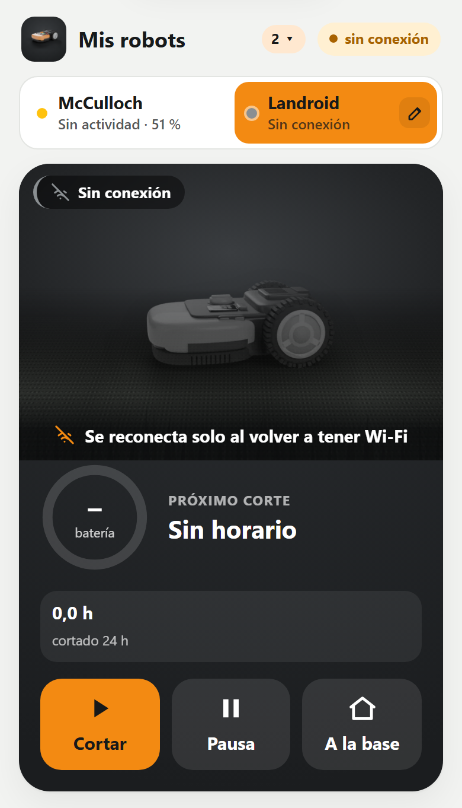
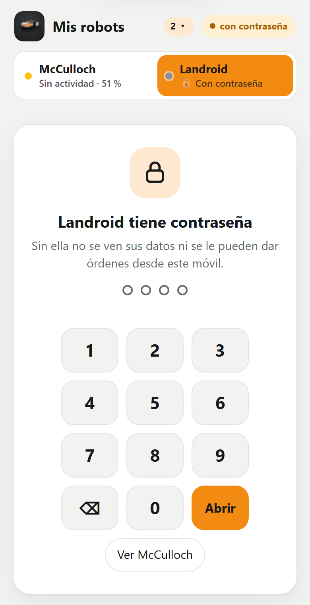
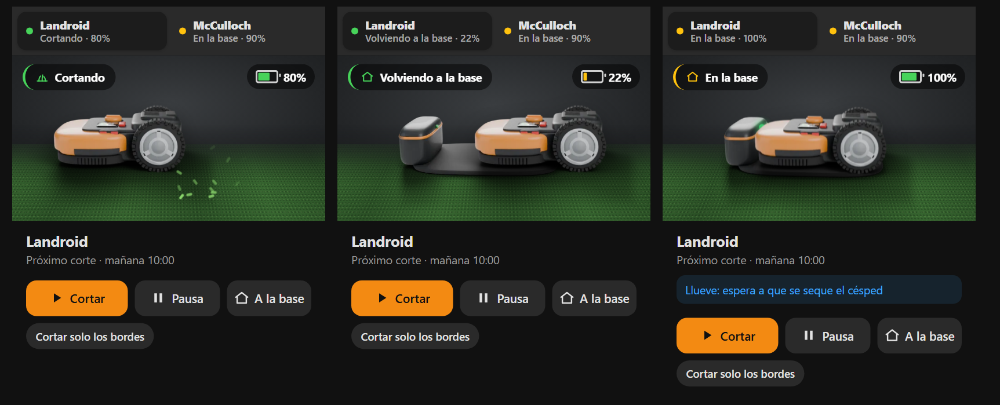
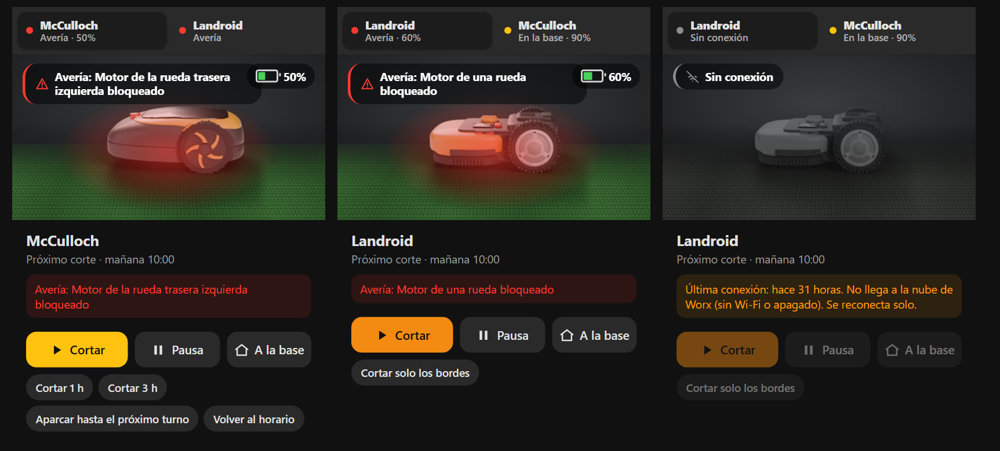

# Robots cortacésped en Home Assistant: McCulloch / Husqvarna por Bluetooth + Worx Landroid

[](https://github.com/odegaard12/ha-mcculloch-husqvarna-ble/releases)
[](https://hacs.xyz)
[](https://github.com/odegaard12/ha-mcculloch-husqvarna-ble/actions)

Tus robots cortacésped en Home Assistant, en una tarjeta y en una app para el móvil:

- **McCulloch ROB, Husqvarna Automower, Gardena SILENO y Flymo Easilife** por **Bluetooth**, sin nube y sin cuenta, con su propia integración (`mcculloch_rob`): unas 50 entidades, horario editable, cortar o aparcar X horas.
- **Worx Landroid**, con la integración [Landroid Cloud](https://github.com/MTrab/landroid_cloud), en la **misma tarjeta y la misma app**: estado, horario, averías, lluvia, sus órdenes y sus avisos.
- **Modelos 3D propios** de los dos robots (hechos en Blender), animados según lo que hacen y que **se giran con el dedo**.
- **Averías en español**: los 160 códigos del protocolo, en HA, en la tarjeta, en la app y en los avisos.
- **App instalable** (PWA) con avisos push, **nombre y contraseña por robot** y actualización automática.

> 🇬🇧 *English summary at the bottom.*

<p align="center">
  
  &nbsp;
  
  &nbsp;
  
</p>

<p align="center"><b>Tarjeta de Home Assistant</b>: uno o dos robots, cada uno con su modelo, su color y sus órdenes.</p>
<p align="center"></p>
<p align="center"></p>
<p align="center"></p>

## Qué incluye

| | McCulloch / Husqvarna (Bluetooth) | Worx Landroid (Landroid Cloud) |
|---|---|---|
| Integración | `mcculloch_rob` (este repo) | la oficial de la comunidad, [Landroid Cloud](https://github.com/MTrab/landroid_cloud) |
| Tarjeta de Lovelace | ✅ | ✅ (como segundo robot o solo) |
| App para el móvil | ✅ | ✅ |
| Modelo 3D que se gira con el dedo | ✅ amarillo y negro | ✅ naranja con su base |
| Horario | ver y **editar** | ver (se edita en la app de Worx) |
| Órdenes | cortar, pausa, a la base, 1 h / 3 h, aparcar hasta el próximo turno, volver al horario | cortar, pausa, a la base, **cortar solo los bordes** |
| Averías en español | ✅ los 160 códigos | ✅ |
| Avisos push | avería, vuelco, levantado, parado en el jardín, 1 y 3 días sin conexión | avería, 1 y 3 días sin conexión, vuelve a conectarse |
| Últimos datos sin cobertura | ✅ guardados en disco | ✅ |

### ¿Qué la diferencia de la integración oficial "Husqvarna Automower BLE"?

| | Oficial | Esta |
|---|---|---|
| Comandos del protocolo | 43 | 98 |
| McCulloch ROB S400 / S600 / S800 | en la lista de modelos | ✅ probado en un S800 |
| Editar el horario desde HA | ❌ | ✅ `mcculloch_rob.set_schedule` |
| Cortar o aparcar durante X horas | ❌ | ✅ |
| Estadísticas, ajustes (ECO, heladas, radar, garaje...) | ❌ | ✅ |
| Averías traducidas | ❌ | ✅ |
| Tarjeta y app | ❌ | ✅ |
| Arreglos de la librería: espera de 1 s antes de abrir el canal (con 5 s el S800 no contesta) y respuestas de un solo campo | — | ✅ |

Usa la librería [AutoMower-BLE](https://github.com/alistair23/AutoMower-BLE) (GPL-3) de Alistair Francis, incluida con dos arreglos.

## Lo que necesitas

1. **Home Assistant 2025.1 o posterior.**
2. Para el McCulloch / Husqvarna, **un receptor Bluetooth cerca del robot**. Es el punto que más falla: el robot conecta bien a **–60 dBm** y deja de conectar hacia **–75 dBm** (error `0x3e` en el log del ESP32).
   - Lo recomendado: un **proxy Bluetooth de ESPHome con antena externa** (ESP32-WROOM-32**U**, no la versión con antena impresa) **cerca de la base**, con Wi-Fi o Ethernet.
   - Valen el adaptador Bluetooth del propio servidor de HA o una antena USB, si llegan con buena señal.
   - En el proxy, deja `scan_parameters` en `interval: 320ms` y `window: 300ms`.
3. **El robot en modo emparejamiento la primera vez.** En el McCulloch ROB: *Ajustes → Instalación → Bluetooth → Nuevo emparejamiento*. Los Husqvarna lo están durante los primeros minutos tras encenderlos.
4. Para el Landroid (opcional): la integración **Landroid Cloud** (HACS) con tu cuenta de Worx.

## Instalación

### 1. Integración y tarjeta

**Con HACS:** *HACS → ⋮ → Repositorios personalizados →* `https://github.com/odegaard12/ha-mcculloch-husqvarna-ble` *(Integración)* → instalar → reiniciar HA. Las versiones nuevas te salen en *Ajustes → Actualizaciones*.

**A mano:** copia `custom_components/mcculloch_rob` en `/config/custom_components/` y reinicia HA.

Luego: *Ajustes → Dispositivos y servicios → Añadir integración → McCulloch ROB (Bluetooth)*. Si el robot está en modo emparejamiento suele aparecer solo como "descubierto".

### 2. Tarjeta en el panel principal

*Editar panel → Añadir tarjeta → "Robots cortacésped (McCulloch / Husqvarna / Landroid)"*. Tiene editor visual: robot, nombre, segundo robot y su nombre. En YAML:

```yaml
type: custom:mcculloch-rob-card
entity: lawn_mower.robot_cortacesped
name: McCulloch              # opcional: el nombre que se ve
entity_2: lawn_mower.landroid  # opcional: segundo robot (otro McCulloch o un Landroid)
name_2: Landroid             # opcional
image: /local/robot.webp     # opcional: foto propia del primer robot
```

- Con dos robots sale arriba una barra con el estado y la batería de cada uno para cambiar de uno a otro.
- El robot **se gira con el dedo**: arrástralo a los lados y, a los 3 segundos, vuelve solo a lo que estaba haciendo.
- Cada robot enseña solo sus botones: el McCulloch "1 h", "3 h", "aparcar hasta el próximo turno" y "volver al horario"; el Landroid "cortar solo los bordes".

**Foto propia:** guarda una imagen PNG o WebP con fondo transparente y el morro mirando a la izquierda en `/config/www/robot.webp` y añade `image: /local/robot.webp`. Así no se pierde al actualizar.

### 3. App para el móvil (opcional): elige una opción

**a) Complemento de Home Assistant** (HA OS o Supervised): sale en el menú lateral, sin token ni PIN.
*Ajustes → Complementos → Tienda → ⋮ → Repositorios →* `https://github.com/odegaard12/ha-mcculloch-husqvarna-ble` → **Robots cortacésped (panel)** → Instalar → "Mostrar en la barra lateral".

**b) Raspberry o cualquier equipo con Docker:**
```bash
git clone https://github.com/odegaard12/ha-mcculloch-husqvarna-ble
cd ha-mcculloch-husqvarna-ble/robot_panel
cp robot_app.env.example robot_app.env   # pon HA_URL, HA_TOKEN y, si quieres, APP_PIN
docker compose up -d --build
```
Ábrela en `http://<ip>:8106`. Para instalarla como app en el móvil tiene que ir por **https**: un túnel de Cloudflare o un proxy inverso con tu dominio. En ese caso **pon siempre `APP_PIN`**.

**c) Sin Docker (Python 3.11+):**
```bash
pip install aiohttp
cd robot_panel && cp robot_app.env.example robot_app.env && python3 server.py
```

El servidor guarda el token de HA y nunca lo envía al navegador; solo deja dar órdenes de los robots, de una lista cerrada.

## La app

- **Inicio:** el robot en 3D según lo que hace (cortando cruza el césped y gira al final de cada pasada; volviendo a la base se queda a medio entrar; cargando, levantado, volcado...), batería, próximo corte y órdenes.
- **Horario**, **Datos** (actividad y batería de 24 h, horas cortadas por día, averías, todo lo que da el robot) y **Ajustes**.
- Se instala en la pantalla de inicio, **se actualiza sola** cuando hay versión nueva y se puede **tirar hacia abajo** para refrescar.
- Sin cobertura enseña **los últimos datos** y desde cuándo, nunca "sin programación".
- Cada robot tiene su color (amarillo el McCulloch, naranja el Landroid) y su icono: nunca se mezcla lo de uno con lo del otro.

### Varios robots

Añade el Landroid (u otro robot) con `ROBOTS` en `robot_app.env`, o con la opción `robots` del complemento:

```
ROBOTS=landroid:Landroid:landroid
```

Formato `prefijo:nombre:tipo`, separados por comas. El prefijo es el id de su `lawn_mower.xxx`, y el tipo es `mcculloch` o `landroid`.

- **Barra arriba** con cada robot (estado y batería) y **Mis robots** con la ficha de cada uno.
- **Nombre:** el lápiz de la barra cambia el nombre del robot que ves. Se guarda en el servidor: sale igual en todos los móviles y en los avisos.
- **Contraseña por robot** (de 4 a 8 cifras), en *Mis robots → Poner contraseña*: en los demás móviles no se ven sus datos ni se le pueden dar órdenes hasta escribirla en su teclado.
  - Lo comprueba el servidor, no solo la pantalla, con límite de intentos.
  - Si hay dos servidores, se copia entre ellos.
  - Sus avisos solo llegan a los móviles que lo tenían desbloqueado al activarlos.

## Avisos al móvil

**Desde la app** (recomendado): *Ajustes → Avisos en este móvil → Activar avisos*.
- Avisa por notificación push de averías (con el texto en español), vuelco, robot levantado, parado en el jardín, 1 o 3 días sin conexión y cuando vuelve a conectarse, con el nombre de cada robot.
- No consulta nada periódicamente: se suscribe a los cambios de Home Assistant.
- Cada aviso sale como mucho una vez cada 6 h, nunca más de 6 al día, y el de "sin conexión" una sola vez por desconexión.
- En iPhone hace falta iOS 16.4 o posterior y abrir la app desde el icono de la pantalla de inicio.

**Desde Home Assistant** (alternativa), con la plantilla de automatización lista para importar:

[](https://my.home-assistant.io/redirect/blueprint_import/?blueprint_url=https%3A%2F%2Fgithub.com%2Fodegaard12%2Fha-mcculloch-husqvarna-ble%2Fblob%2Fmain%2Fblueprints%2Fautomation%2Fmcculloch_rob%2Favisos_robot.yaml)

El plazo de "sin conexión" se cuenta con el sensor **Última conexión**, que la integración guarda en disco: no se reinicia aunque reinicies Home Assistant.

## Servicios (McCulloch / Husqvarna)

| Servicio | Qué hace |
|---|---|
| `mcculloch_rob.set_schedule` | Sustituye el horario: `tasks: [{start: "10:00", end: "14:00", days: [monday, wednesday]}]` |
| `mcculloch_rob.mow_for` | Corta ahora durante `hours` (0,5–24), saltándose el horario |
| `mcculloch_rob.park_for` | Aparca durante `hours` (0,5–168) y luego vuelve al horario |
| `mcculloch_rob.send_command` | Envía cualquier comando del protocolo (avanzado) |
| `mcculloch_rob.probe` | Lista qué comandos responde tu modelo |

El sensor **Error** sale traducido en HA y lleva el atributo `descripcion` con el texto en español, para usarlo en automatizaciones.

## Modelos

- **Por Bluetooth:** todos los que reconoce AutoMower-BLE: McCulloch ROB S400/S600/S800; Husqvarna Automower 105–550 (incluidos Mark II, Nera y EPOS); Gardena SILENO City/Life/Minimo/sense; Flymo Easilife. **Probado a fondo en un McCulloch ROB S800.** Si lo pruebas en otro, abre un issue con el resultado de `mcculloch_rob.probe`.
- **Landroid:** los que maneja Landroid Cloud (probado con un Landroid L).

## Modelos 3D

`tools/blender/rob_model.py` (McCulloch) y `tools/blender/landroid_model.py` (Landroid) crean los robots por código en Blender, sin logotipos, y los renderizan desde 24 ángulos con su base de carga. `tools/blender/to_web.py` los recorta y los pasa a WebP.

```bash
blender -b -P tools/blender/landroid_model.py -- salida all
python tools/blender/to_web.py salida custom_components/mcculloch_rob/www/rob3d_landroid
```

## Problemas típicos

- **"No conecta" o el log del ESP32 muestra `DISCONNECT 0x3e` / status 133:** el receptor está lejos. Acércalo o ponle antena externa.
- **No aparece el robot:** comprueba que lo ves en *Ajustes → Bluetooth → Anuncios*. Si usas herramientas que se suscriben a los anuncios del proxy, recarga la entrada de ESPHome: el proxy solo los manda a un cliente.
- **Pide PIN o rechaza la conexión:** vuelve a poner el robot en modo emparejamiento y añade la integración otra vez.
- **El Landroid sale "sin conexión":** no llega a la nube de Worx (Wi-Fi). La app y la tarjeta enseñan sus últimos datos hasta que vuelva.

## Aviso

Proyecto independiente, sin relación con Husqvarna Group, McCulloch, Gardena, Flymo ni Worx/Positec. Las marcas son de sus dueños. Úsalo bajo tu responsabilidad: un cortacésped es una máquina con cuchillas.

## Licencia

GPL-3.0, la misma que AutoMower-BLE.

---

### English summary

**Robot mowers in Home Assistant: McCulloch ROB / Husqvarna Automower / Gardena SILENO / Flymo Easilife over local Bluetooth, plus Worx Landroid.**

- Bluetooth integration (`mcculloch_rob`), no cloud: 98 protocol commands, schedule editing, mow/park for N hours, ~50 entities. An extended alternative to the core *Husqvarna Automower BLE* integration.
- Lovelace card (`custom:mcculloch-rob-card`) for one or two mowers. The second one can be a Worx Landroid from the Landroid Cloud integration. It has custom Blender 3D models you can spin with your finger.
- Installable web app (HA add-on, Docker or plain Python):
  - push notifications;
  - a name and a password per mower;
  - last known data when out of range;
  - auto-update.
- All 160 error codes translated to Spanish.

Install via HACS as a custom repository. For Bluetooth you need a proxy **close to the mower** (≈ –60 dBm; an ESP32-WROOM-32U with an external antenna is recommended), and the mower must be in pairing mode the first time.
