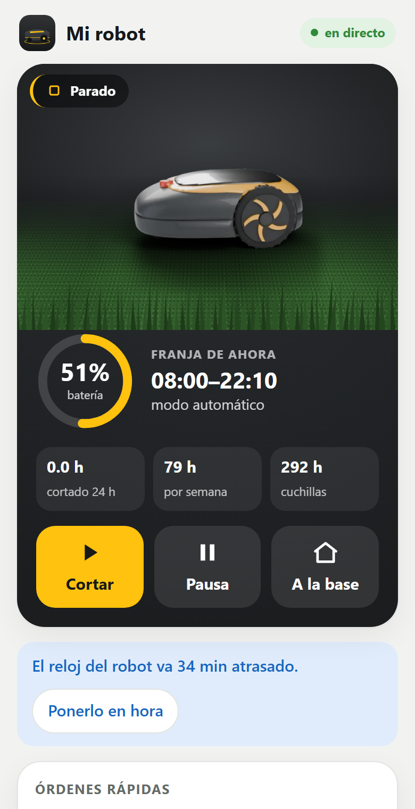
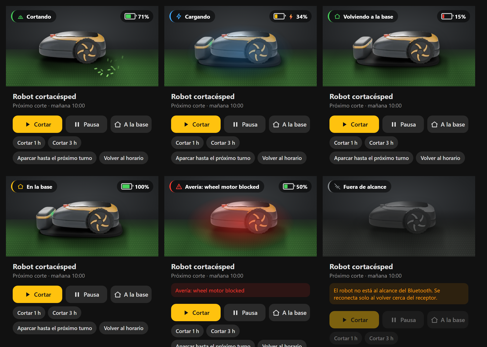

# McCulloch / Husqvarna robot mower — Bluetooth para Home Assistant

Controla tu robot cortacésped **McCulloch ROB, Husqvarna Automower, Gardena SILENO o Flymo Easilife** desde Home Assistant **por Bluetooth, sin nube y sin cuenta**. Incluye:

- **Integración** (`mcculloch_rob`): unas 50 entidades (batería, estado, actividad, próximo corte, errores, sensores de choque, levantado y volcado, estadísticas, ajustes), órdenes (cortar, pausa, a la base), cambio del horario y "cortar o aparcar durante X horas".
- **Tarjeta de Lovelace** con el robot animado según su estado. Va dentro de la integración: no hay que instalar nada más.
- **Panel web estilo app** (opcional), que se puede instalar en el móvil: como complemento de HA, en una Raspberry o en cualquier equipo con Docker.

> 🇬🇧 *English summary at the bottom.*

<p align="center">
  
  &nbsp;
  
</p>

El robot es un **modelo 3D propio hecho en Blender** (`tools/blender/rob_model.py`, sin logotipos), renderizado desde 24 ángulos. Se anima según su estado: al cortar cruza el césped, **gira en 3D** al final de cada pasada y deja una estela; se le ve cargar, volver a la base, levantado o **volcado** (da la vuelta en 3D). En *Datos* tienes la actividad y la batería de 24 h y las **horas cortadas por día** de la última semana.

## ¿Qué la diferencia de la integración oficial "Husqvarna Automower BLE"?

| | Oficial | Esta |
|---|---|---|
| Comandos del protocolo | 43 | 98 |
| McCulloch ROB S400 / S600 / S800 | en la lista de modelos | ✅ probado en un S800 |
| Editar el horario desde HA | ❌ | ✅ `mcculloch_rob.set_schedule` |
| Cortar o aparcar durante X horas | ❌ | ✅ |
| Estadísticas, ajustes (ECO, heladas, radar, garaje...) | ❌ | ✅ |
| Tarjeta y panel | ❌ | ✅ |
| Arreglos de la librería: espera de 1 s antes de abrir el canal (con 5 s el S800 no contesta) y respuestas de un solo campo | — | ✅ |

Usa la librería [AutoMower-BLE](https://github.com/alistair23/AutoMower-BLE) (GPL-3) de Alistair Francis, incluida con dos arreglos.

## Lo que necesitas

1. **Home Assistant 2025.1 o posterior.**
2. **Un receptor Bluetooth cerca del robot.** Este es el punto que más falla. El robot se conecta bien a **–60 dBm** y deja de conectar hacia **–75 dBm** (error `0x3e` en el log del ESP32).
   - Lo recomendado: un **proxy Bluetooth de ESPHome con antena externa** (ESP32-WROOM-32**U**, no la versión con antena impresa) colocado **cerca de la base**, con WiFi o Ethernet.
   - Valen el adaptador Bluetooth del propio servidor de HA o una antena USB, si llegan con buena señal.
   - En el proxy, deja `scan_parameters` en `interval: 320ms` y `window: 300ms`.
3. **El robot en modo emparejamiento la primera vez.** En el McCulloch ROB: *Ajustes → Instalación → Bluetooth → Nuevo emparejamiento*. Los Husqvarna lo están durante los primeros minutos tras encenderlos.

## Instalación

### 1. Integración y tarjeta

**Con HACS:** *HACS → ⋮ → Repositorios personalizados →* `https://github.com/odegaard12/ha-mcculloch-husqvarna-ble` *(Integración)* → instalar → reiniciar HA.

**A mano:** copia `custom_components/mcculloch_rob` en `/config/custom_components/` y reinicia HA.

Luego: *Ajustes → Dispositivos y servicios → Añadir integración → McCulloch ROB (Bluetooth)*. Si el robot está en modo emparejamiento suele aparecer solo como "descubierto".

### 2. Tarjeta en el panel principal

*Editar panel → Añadir tarjeta → "McCulloch / Husqvarna robot"*. Tiene editor visual. En YAML:

```yaml
type: custom:mcculloch-rob-card
entity: lawn_mower.robot_cortacesped
name: Robot               # opcional
image: /local/robot.webp  # opcional: tu propia foto
```

Muestra el estado animado, la batería, el próximo corte y los botones Cortar / Pausa / A la base, más "1 h", "3 h", "aparcar hasta el próximo turno" y "volver al horario".

**Tu propia foto:** guarda una imagen PNG o WebP con fondo transparente, con el morro mirando a la izquierda, en `/config/www/robot.webp`, y añade `image: /local/robot.webp` a la tarjeta. Así no se pierde al actualizar. Si no hay foto, la tarjeta usa un dibujo.

**Actualizaciones:** si la instalas desde HACS, HA te avisa en *Ajustes → Actualizaciones* cuando sale una versión nueva.

### 3. Panel web (opcional): elige una opción

**a) Complemento de Home Assistant** (HA OS o Supervised): aparece en el menú lateral, sin token ni PIN.
*Ajustes → Complementos → Tienda → ⋮ → Repositorios →* `https://github.com/odegaard12/ha-mcculloch-husqvarna-ble` → **Robot cortacésped (panel)** → Instalar → "Mostrar en la barra lateral".

**b) Raspberry o cualquier equipo con Docker:**
```bash
git clone https://github.com/odegaard12/ha-mcculloch-husqvarna-ble
cd ha-mcculloch-husqvarna-ble/robot_panel
cp robot_app.env.example robot_app.env   # pon HA_URL, HA_TOKEN y, si quieres, APP_PIN
docker compose up -d --build
```
Ábrelo en `http://<ip>:8106`. Para instalarlo como app en el móvil tiene que ir por **https**: un túnel de Cloudflare o un proxy inverso con tu dominio. En ese caso **pon siempre `APP_PIN`**.

**c) Sin Docker (Python 3.11+):**
```bash
pip install aiohttp
cd robot_panel && cp robot_app.env.example robot_app.env && python3 server.py
```

El servidor guarda el token de HA y nunca lo envía al navegador. Además solo permite órdenes del robot, de una lista cerrada.

### Varios robots en la misma app

¿Tienes también un **Worx Landroid** (integración [Landroid Cloud](https://github.com/MTrab/landroid_cloud))? Añádelo con `ROBOTS` en `robot_app.env` (u opción `robots` del complemento):

```
ROBOTS=landroid:Landroid:landroid
```

Formato `prefijo:nombre:tipo`, separados por comas. El prefijo es el id de su `lawn_mower.xxx`, y el tipo es `mcculloch` o `landroid`. Arriba sale una barra con los robots, con su estado y su batería, para cambiar de uno a otro. Tocando **Mis robots** se abre una ficha de cada uno.

Del Landroid se ven:
- el estado y la batería;
- el horario guardado, solo para consultar: se edita en la app de Worx;
- la actividad de 24 h y de 7 días, el error, la lluvia, la señal Wi-Fi y el uso acumulado;
- sus interruptores: modo fiesta, bloqueo, Off Limits y horario automático.

Las órdenes Cortar, Pausa, A la base y Cortar solo los bordes también funcionan. Sin conexión se quedan sus últimos datos.

## Avisos al móvil

**Desde la web app** (recomendado): en *Ajustes → Avisos en este móvil → Activar avisos*. El panel avisa por notificación push de avería, vuelco, robot levantado, parado en el jardín y 1 o 3 días sin conexión. No consulta nada periódicamente: se suscribe a los cambios de Home Assistant. Cada aviso sale como mucho una vez cada 6 h y nunca más de 6 al día. En iPhone hace falta iOS 16.4 o posterior y abrir la app desde el icono de la pantalla de inicio. Las claves VAPID se crean con `py_vapid` en `vapid_private.pem`, junto a `server.py`.

**Desde Home Assistant** (alternativa), con la plantilla de automatización lista para importar: avisa en la app de Home Assistant cuando el robot tiene una **avería**, se **vuelca**, se queda **levantado**, se **para en el jardín** esperando ayuda o lleva **días sin conexión** Bluetooth.

[](https://my.home-assistant.io/redirect/blueprint_import/?blueprint_url=https%3A%2F%2Fgithub.com%2Fodegaard12%2Fha-mcculloch-husqvarna-ble%2Fblob%2Fmain%2Fblueprints%2Fautomation%2Fmcculloch_rob%2Favisos_robot.yaml)

El plazo de "sin conexión" se cuenta con el sensor **Última conexión**, que la integración guarda en disco: no se reinicia aunque reinicies Home Assistant, y sigue disponible aunque el robot no responda.

## Servicios

| Servicio | Qué hace |
|---|---|
| `mcculloch_rob.set_schedule` | Sustituye el horario: `tasks: [{start: "10:00", end: "14:00", days: [monday, wednesday]}]` |
| `mcculloch_rob.mow_for` | Corta ahora durante `hours` (0,5–24), saltándose el horario |
| `mcculloch_rob.park_for` | Aparca durante `hours` (0,5–168) y luego vuelve al horario |
| `mcculloch_rob.send_command` | Envía cualquier comando del protocolo (avanzado) |
| `mcculloch_rob.probe` | Lista qué comandos responde tu modelo |

## Modelos

Todos los que reconoce AutoMower-BLE: McCulloch ROB S400/S600/S800; Husqvarna Automower 105–550 (incluidos Mark II, Nera y EPOS); Gardena SILENO City/Life/Minimo/sense; Flymo Easilife. **Solo se ha probado a fondo en un McCulloch ROB S800.** Si lo pruebas en otro modelo, abre un issue con el resultado de `mcculloch_rob.probe`.

## Problemas típicos

- **"No conecta" o el log del ESP32 muestra `DISCONNECT 0x3e` / status 133:** el receptor está lejos. Acércalo o ponle antena externa.
- **No aparece el robot:** comprueba que lo ves en *Ajustes → Bluetooth → Anuncios*. Si usas herramientas que se suscriben a los anuncios del proxy, recarga la entrada de ESPHome: el proxy solo los manda a un cliente.
- **Pide PIN o rechaza la conexión:** vuelve a poner el robot en modo emparejamiento y añade la integración otra vez.

## Aviso

Proyecto independiente, sin relación con Husqvarna Group, McCulloch, Gardena ni Flymo. Las marcas son de sus dueños. Úsalo bajo tu responsabilidad: un cortacésped es una máquina con cuchillas.

## Licencia

GPL-3.0, la misma que AutoMower-BLE.

---

### English summary

Local Bluetooth control for **McCulloch ROB, Husqvarna Automower, Gardena SILENO and Flymo Easilife** robot mowers. An extended alternative to the core *Husqvarna Automower BLE* integration, with 98 protocol commands, schedule editing, mow/park for N hours, ~50 entities, a built-in animated Lovelace card (`custom:mcculloch-rob-card`) and an optional app-style web panel (HA add-on, Docker or plain Python). Install via HACS as a custom repository. You need a Bluetooth proxy **close to the mower** (≈ –60 dBm; an ESP32-WROOM-32U with an external antenna is recommended), and the mower must be in pairing mode the first time.
